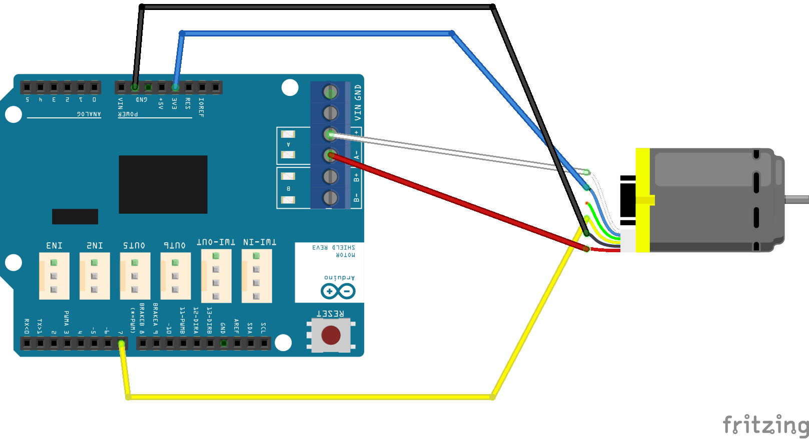
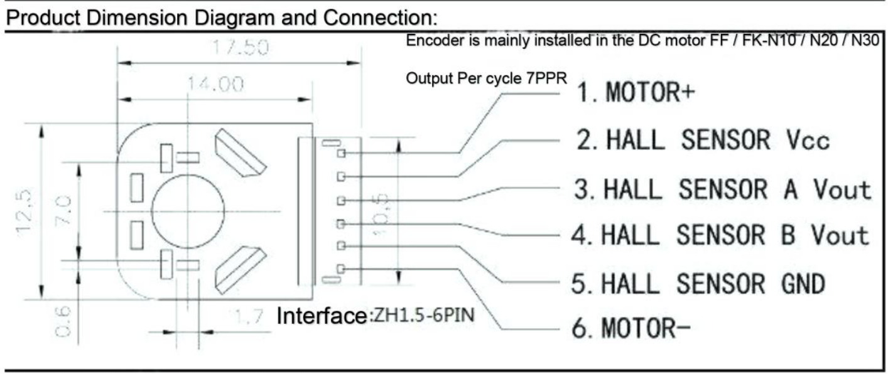
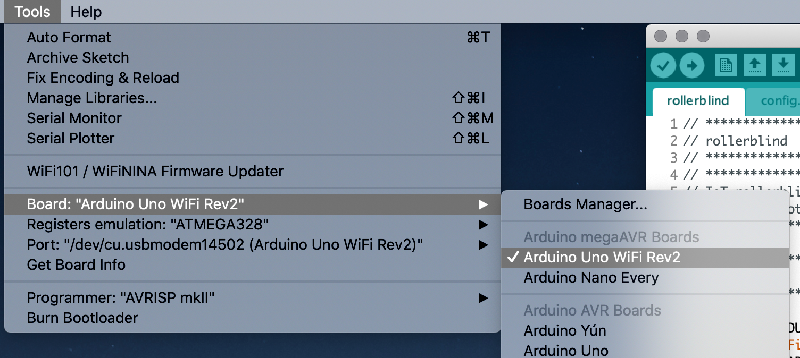

# DIY Smart Rollerblind (IKEA Tupplur)

This project builds a smart rollerblind which can be controller via MQTT. Configuration examples for the **Home Assistant** smart home platform are also provided. The base for the project is the IKEA Tupplur rollerblind.

# Parts

- [Arduino UNO WiFi Rev.2](https://store.arduino.cc/arduino-uno-wifi-rev2)
- [Arduino Motor Shield](https://store.arduino.cc/arduino-motor-shield-rev3)
- IKEA Tupplur rollerblind
- DC gear motor with encoder, e.g. [V-TEC 6V Mini 25D](https://eckstein-shop.de/V-TEC-6V-Mini-25D-DC-Motor-Getriebe-Motor-Stirnradgetriebe-mit-Encoder-177-RPM)
- Alternative motors: [6V 270rpm Encoder Motor DC Gear Motor](https://www.banggood.com/6V-270rpm-Encoder-Motor-DC-Gear-Motor-p-1127552.html?cur_warehouse=CN), [CHIHAI MOTOR GM25-370 DC Gear Motor](https://www.banggood.com/CHIHAI-MOTOR-GM25-370-DC-Gear-Motor-6V-100210300RPM-Encoder-Motor-p-1016183.html?akmClientCountry=DE&p=PW041611183930201706&custlixnkid=316774&ID=519630&cur_warehouse=CN)
- 3D printer to print necessary cases & parts

If one of the alternative motors is to be used, please double check the wiring as it may differ from the V-TEC motor. In case the implementation does not work with the encoder of those motors, let me know, as I haven't tested those motors.

Please note that this project is not compatible with the newer models of IKEA rollerblinds.

The project *should* also work with other Arduino boards, as long as the same motor shield is used, and the board features a network connection (wired/wireless). If a wired connection was to be used, code adjustments need to be made (contact me).

# Concept

## MQTT

This project uses MQTT as communication layer between the rollerblind and the home automation server. For this, several MQTT topics are being users:

- State topic
- Position topic
- Config topic
- Control topic
- Calibration topic

The **State topic** will maintain the rollerblind's state via a single retained message. The state can be (according to Home Assistant's MQTT cover): `state_open`, `state_opening`, `state_closed` or `state_closing`. The topic is used for communication with Home Assistant.

The **Position topic** will maintain the rollerblind's current position via a single retained message, which is updated whenever the rollerblind moves. 

The **Config topic** will maintain the calibrated length of the cover via a single retained message. It will only change when calibration is manually triggered. 

The **Control topic** is used to trigger moving-actions on the rollerblind. If the payload is a single number between 100 and 0, the rollerblind will move to the respective position, where 100 equals fully raised and 0 equals fully lowered. If -1 is given as payload, the currently moving rollerblind will be halted.

The **Calibration topic** is used to manually start calibration of the cover length.

## Power outage

Since the position and calibration is persisted on the MQTT broker, the rollerblind can be disconnected from power at any time. However, the physical position of the rollerblind must not be changed (e.g. it should not be unrolled, because the stored position will no longer match the real position).

## Motor

The DC motor features a hall encoder, which allows to precisely control the motors position. Stepper motors *could* also be used, however those might not serve the purpose well enough regarding resting position & strength.

# Installation Guide

## (1) Wiring

1) Connect motor + and - wires to the according ports for motor A on the motor shield.

2) Connect the encoder's VCC wire to the 3V port of the motor shield

3) Connect the encoder's GND wire to one of the GND ports on the motor shield.

4) Finally, connect the encoder's B output wire to digital pin 7 on the motor shield.





## (2) Code

Before the controller is operational, the sketch provided in this repository needs to be adjusted & uploaded to the Arduino. It is advised to use the [Arduno IDE](https://www.arduino.cc/en/main/software) for this.

1) Clone this repository, and create a new file named `config.h` in the same directory. 

2) Open the sketch (`rollerblind.ino`) in the Arduino IDE

3) Open the file `config.h` and put the following:

```
#define WIFI_PASS "myWifiPassword"
#define WIFI_SSID "myWifiName"

#define MQTT_ID     "someUniqueIdentifier"
#define MQTT_HOST   "myMQTTHost"
#define MQTT_PORT   1883

#define TOPIC_STATE      "ha/rollerblind/bedroom/status"
#define TOPIC_POSITION   "ha/rollerblind/bedroom/position"
#define TOPIC_CONFIG     "ha/rollerblind/bedroom/cfg"

#define TOPIC_CONTROL    "ha/rollerblind/bedroom/control"
#define TOPIC_CALIBRATE  "ha/rollerblind/bedroom/calibrate"
```

Adjust the parameters for your needs. The topics in this file need to be configured in your home automation software.

4) Select the board & port in the Arduino IDE



5) **Compile** the sketch and **Upload** the sketch

6) Open the serial monitor via "Tools" -> "Serial monitor". If no new messages appear (e.g. the controller already fully booted), press the reset button so it boots again and the messages can be seen.

7) Check the appearing messages in the serial console. Something similar to this should be printed:

```
18:37:57.924 -> [WIFI] Connecting to network unity ... connected
18:38:03.740 -> [MQTT] Connecting to host ceres.universe ... connected
18:38:03.812 -> [MQTT] Subscribing to topic: ha/rollerblind/bedroom/control ... done
18:38:03.881 -> [MQTT] Subscribing to topic: ha/rollerblind/bedroom/calibrate ... done
18:38:03.950 -> [MQTT] Subscribing to topic: ha/rollerblind/bedroom/position ... done
18:38:04.019 -> [MQTT] Subscribing to topic: ha/rollerblind/bedroom/cfg ... done
```

8) The controller is now ready and can be used.

## (3) Calibration

### Attention

When going down, the motor will spin backward (CCW), and when raising, the motor will spin forward (CW). This needs to be considered when plugging the motor adapter into the tube of the rollerblind, so its on the correct side.

*Before* mounting, check via the calibration process if the correct side was picked and the motor spins in the correct direction.

Of course, the **real** calibration must be done **after** the rollerblind was mounted on the wall/ceiling.

### Calibrate

Before calibrating, make sure the rollerblind is **fully rolled up**, or at the desired top/open position.

1) In order to start the calibration, send a message with empty payload to the calibration topic:

```
pi@ceres:~ $ mosquitto_pub -h ceres.universe -t 'ha/rollerblind/bedroom/calibrate' -m ''
pi@ceres:~ $
```

The motor will now start to spin, lowering the rollerblind. 

2) Send *another empty* message to the same topic, when the desired bottom position has been reached.

3) The rollerblind will now raise again up to the initial position. Calibration is completed.

## (4) Home Assistant

An example configuration for home assistant might look like:

```
cover:
  - platform: mqtt
    name: "Rollo Schlafzimmer"
    command_topic: "ha/rollerblind/bedroom/control"
    state_topic: "ha/rollerblind/bedroom/status"
    position_topic: "ha/rollerblind/bedroom/position"
    qos: 0
    payload_open: "100"
    payload_close: "0"
    payload_stop: "-1"
    optimistic: false
```
